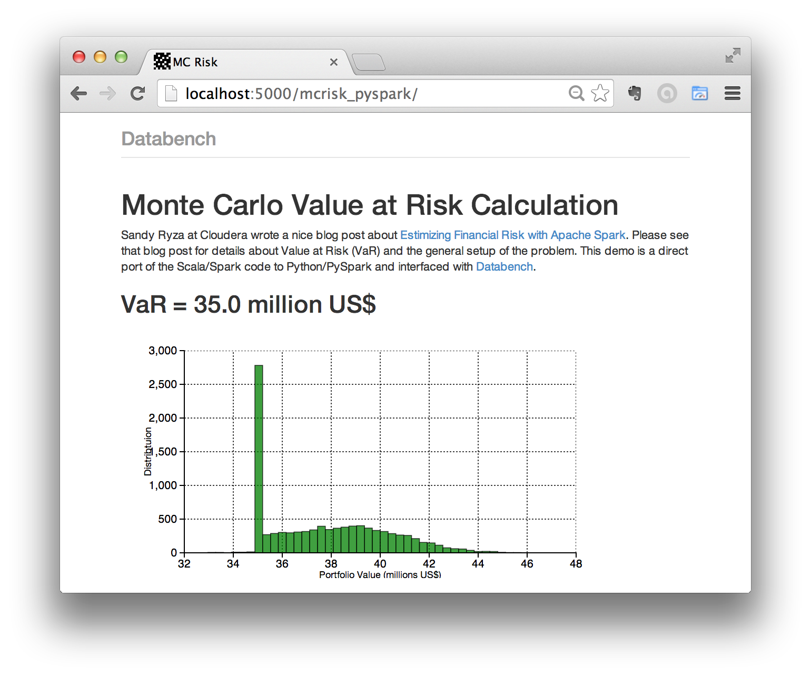

# Databench and Spark

This demo runs `pyspark` locally and interfaces with [Databench](http://www.svenkreiss.com/databench/). On a Mac, run `brew install apache-spark` which installs `spark` and `pyspark`. As a test, you can run `pyspark helloworld_standalone.py`.

For Databench, run `pip install -r requirements.txt` and then run `databench`.
This is tested with Databench 0.3.9 and Spark 1.2.0.

The `mcrisk` example is based on [montecarlorisk](https://github.com/sryza/montecarlorisk) code in Scala/Spark which is explained in this Cloudera blog post by Sandy Ryza: [Estimizing Financial Risk with Apache Spark](http://blog.cloudera.com/blog/2014/07/estimating-financial-risk-with-apache-spark/). The article says "chart generated by pulling the density results into a spreadsheet" which is automated with Databench here.




## Minimal Dockerfile for a Spark Analysis with Databench

```
FROM dockerbase/devbase-spark
MAINTAINER Sven Kreiss <me@svenkreiss.com>

RUN sudo apt-get update && \
    sudo apt-get install -y python-pip python-dev python-virtualenv && \
    sudo apt-get clean

# now add code that changes (not cached) and install the rest of the
# dependencies
ADD . /home/devbase/databench_spark
WORKDIR /home/devbase/databench_spark
RUN sudo pip install -r requirements.txt

EXPOSE 5000
CMD ["databench", "--host=0.0.0.0"]
```

The `Dockerfile` in this repo is an extension of that as the `mc_risk` demo
also needs matplotlib.

You can build the Docker image `sparktest` from this repo and run it with:

```
$ docker build -t="sparktest" .
$ docker run -d -P sparktest
```


## Notes

I am also working on interfacing Databench with Scala and then running the mcrisk example in Scala with Databench. Some dev notes (meaning nothing works) are here [notes_emr](notes_emr.md).
